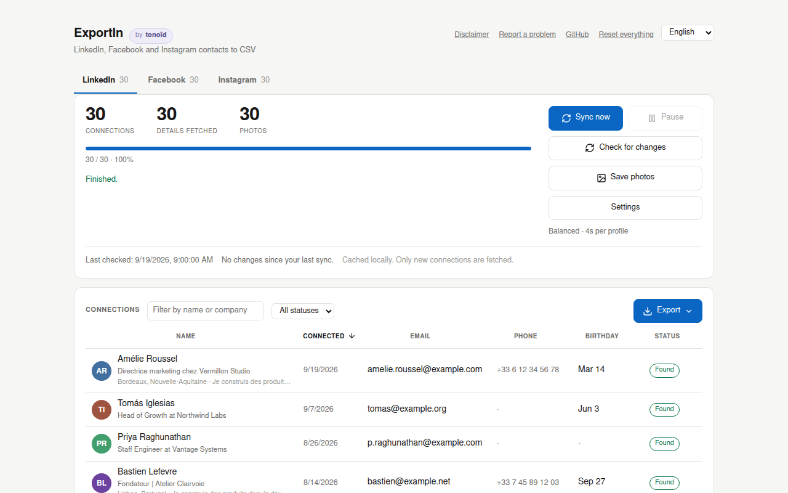
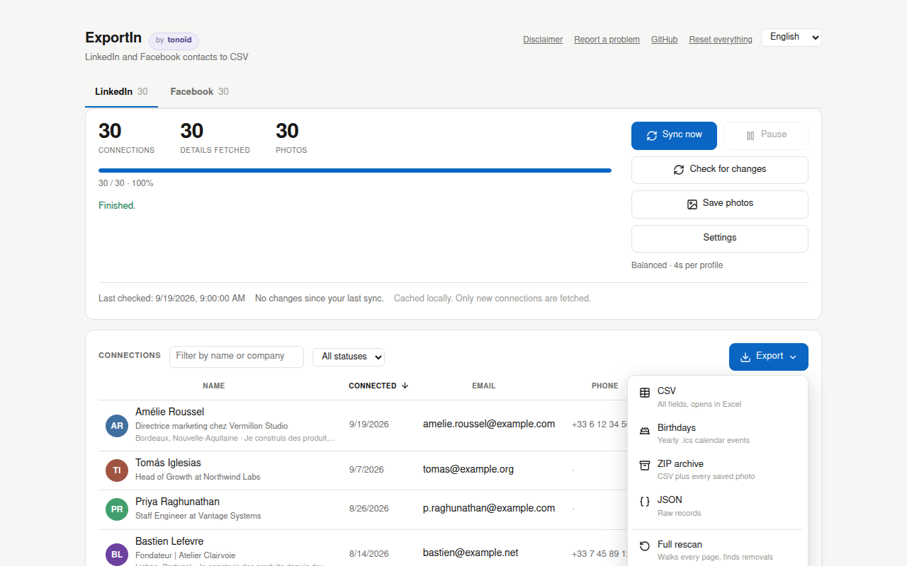
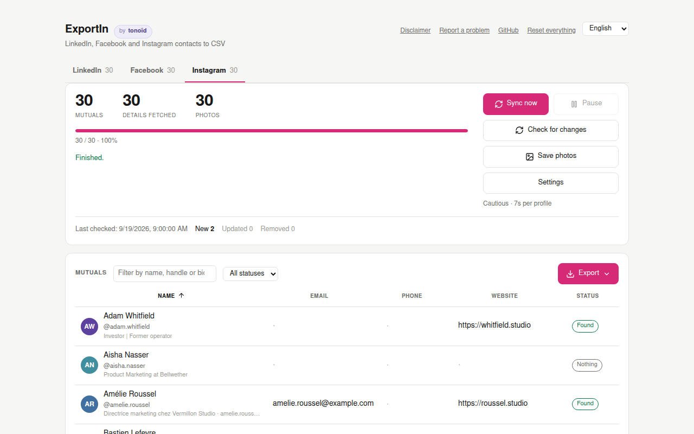

<div align="center">

# ExportIn

**A Chrome extension that gets your contacts' birthdays out of LinkedIn and Facebook, and your Instagram mutuals' contact details, into CSV files for your CRM. Everything stays in your browser. Who you write to, and what you say, is up to you. Free and open source.**

[](LICENSE)
[](https://www.tonoid.com)

English · [Français](README_FR.md) · [Español](README_ES.md)

[Disclaimer](#disclaimer) · [Install](#install) · [Usage](#usage) · [What you get](#what-you-get) · [How it works](#how-it-works) · [When something breaks](#when-a-network-changes-something) · [FAQ](#faq)

</div>

---

## Disclaimer

**Read this before installing. The extension asks you again on first launch.**

**Terms of service.** ExportIn automates requests your browser already makes when you browse LinkedIn, Facebook and Instagram. Automated collection is still against all three user agreements, and accounts have been restricted and suspended for it. The default pace is deliberately slow. That lowers the risk; it does not remove it.

**Personal data.** What you export is other people's personal data. Once it is in your CRM, you are responsible for it under the GDPR and similar laws: a legitimate purpose, a retention period, and the right of access and erasure. These people agreed to be your connections, not to join your prospect list. Facebook adds the birth year when a friend shares it, which gives an exact age. Treat it as sensitive. Handing the file to an AI service shares it with that service, so check where it runs and what it keeps.

**No warranty.** The software is provided as is. tonoïd is not liable for a restricted account, lost data or any other damage from its use. See the [MIT license](LICENSE).

---

## Why

A birthday is the easiest reason there is to get back in touch with someone. The hard part is knowing when. LinkedIn and Facebook both know your contacts' birthdays, and neither lets you take them out.

- LinkedIn's official export (Settings, Data privacy, Get a copy of your data) gives names, companies, titles, the date you connected, and sometimes an email. **No birthdays, no phone numbers, no photos.** Those live in each profile's Contact info panel, one profile at a time.
- Facebook's own download lists your friends and when you became friends. No birthday, no photo.

ExportIn gets every birthday it can find on both networks, with the details around it, into one CSV per network. The two files share the same birthday columns. They are meant to feed an AI agent that enriches your CRM: match the same person across LinkedIn and Facebook, fill in their birthday, point out the people you have not spoken to in a year. You stop learning about a birthday from a notification the day after.

Instagram has no birthdays to give. Its tab exports the people you follow who follow you back, with the bio, link, category and follower count, and any email written in the bio. That is enough to tie an Instagram handle to someone already in your CRM.

A few choices make the files easy for an agent to read. Dates are ISO (`1988-03-14`), with day, month and year also in separate columns, so nothing has to guess what `03/04` means. On LinkedIn, the optional About section adds the person's own words about what they do, which gives an agent something real to write from. If reminders are all you want, the Birthdays export turns the same dates into a yearly calendar.

ExportIn itself calls no AI and sends nothing anywhere. It collects at a slow, adjustable pace and keeps everything in your browser, with no account, no server and no telemetry. Which agent gets the file, if any, is your call.

<div align="center">
  
  <br><sub>Every name, face and address in these screenshots is invented.</sub>
</div>

---

## Install

**[Install from the Chrome Web Store](https://chromewebstore.google.com/detail/leninmleheiaooeecleicccbceiahlhi)**. Or download `exportin-1.1.0.zip` from the [latest release](https://github.com/tonoid/ExportIn/releases/latest), or load the source in developer mode:

```bash
git clone https://github.com/tonoid/ExportIn
```

1. Go to `chrome://extensions/`
2. Turn on **Developer mode** (top right)
3. Click **Load unpacked** and select the **`ExportIn/dist/`** folder

Load `dist/`, not the repository root. The panel opens by itself after installing, and again after each update.

---

## Usage

Click the toolbar icon. ExportIn opens in **its own tab**, not a popup, so you can follow the progress while you work elsewhere. It has one tab per network, and they can all collect at the same time. A ring on each tab shows the progress of a job you are not looking at.

The requests run from a LinkedIn, Facebook or Instagram tab that ExportIn opens **in the background** and never brings to the front. Closing that tab pauses the job.

| Button | What it does |
| --- | --- |
| **Start** / **Resume** | first full collection, or picks up where it stopped |
| **Sync now** | fetches only what changed since last time |
| **Check for changes** | lists new and changed contacts without fetching their details |
| **Save photos** | downloads the avatars and keeps them locally |
| **Pause** | stops after the current request |

The main button renames itself to say what it will actually do. The Export menu also has **Full rescan**, which walks every page to find people who removed you, and **Clear stored data** for the network on screen. **Reset everything**, at the top of the panel, wipes every network, the photos and the settings after a warning.

### The table

Each contact shows with its photo, name, headline and details, 40 per page. Click a column header to sort, click again to reverse. Empty cells always sort last. A search box and a status filter narrow the list.

| Status | Meaning |
| --- | --- |
| Pending | queued, details not fetched yet (LinkedIn, Instagram) |
| Found | at least one email, phone, birthday or website; on Facebook, a birthday |
| Nothing | fetched fine, the person shares nothing |
| No access | the network refused this profile, or it no longer exists; the reason is in the tooltip |
| Removed | missing from the list at the last full rescan |

Birthdays are shown in the panel language on both tabs: "Mar 14", "14 mars", "14 mar".

### Exports

<div align="center">
  
</div>

| Format | Contents |
| --- | --- |
| **CSV** | every field, UTF-8 with BOM and CRLF so Excel opens it cleanly |
| **Birthdays** | an `.ics` file of yearly recurring events |
| **ZIP archive** | the CSV plus `photos/<id>.jpg` |
| **JSON** | the raw records |

An export always covers every contact on that tab, not the page or the filter on screen. Cells that start with `=`, `+`, `-` or `@` are escaped so a spreadsheet never runs them as formulas.

**Column names follow the panel language.** A French export writes `prenom,nom,date_anniv,...`, a Spanish one `nombre,apellido,fecha_cumple,...`. Only the header row changes; the values are the same in every language. Changing the language therefore changes the mapping your CRM remembers.

**Birthdays are in ISO format.** `dateBday` is `1988-03-14` with the year and `03-14` without. `14/03` and `03/14` read differently in two countries, and a CRM import never asks which you meant. `dayBday`, `monthBday` and `yearBday` hold the same date as separate numbers. LinkedIn and Facebook both export these four columns, so one CRM mapping imports either file. Instagram has no birthday columns.

---

## What you get

### LinkedIn

| Column | Source | Note |
| --- | --- | --- |
| firstName, lastName, headline | connection list | always present |
| connectedOn | connection list | exact date |
| profileUrl, publicId, memberUrn | connection list | always present |
| title | guessed from the headline | exact company with the option below |
| company, location, connections | profile, optional | "Exact job and location" in Settings |
| about | About section, optional | "About section" in Settings; paragraphs kept |
| email | Contact info panel | only if the person shares it |
| phone, website, address, twitter, im | Contact info panel | only if shared |
| dateBday, dayBday, monthBday | Contact info panel | `yearBday` stays empty, LinkedIn never shows the year |
| photoUrl | connection list | signed link that expires, see [Photos](#photos) |
| firstSeen, lastSeen, removed, note | local cache | change tracking; `note` holds the reason for "No access" |

Most people share nothing in their Contact info panel. Expect many empty cells: that is their privacy setting, not a bug.

The two options in Settings each add one request per profile, so each one roughly doubles the time. Both are off by default.

### Facebook

| Column | Source | Note |
| --- | --- | --- |
| firstName, lastName | split from the name | Facebook only stores a display name |
| name | as is | the full name, never rebuilt |
| dateBday, dayBday, monthBday | birthdays | day and month as numbers |
| yearBday | birthdays | only if the friend shares it |
| age | computed | empty without the year |
| mutualFriends | friend list | a number: "12 mutual friends" becomes 12 |
| gender, profileUrl, photoUrl, facebookId | both | always present |
| firstSeen, lastSeen, removed | local cache | change tracking |

On a real account of 1486 friends, 80% had a visible birthday and 45% of those also showed the year. We checked by hand that the missing years are really hidden: on a random sample, the profile's About page shows the date and not the year. There is no extra pass to find them because there is nothing to find.

Facebook exposes no email, phone, job or city for friends. A pass that read job and city from each friend's hovercard was built and then removed: one request per friend, hours for a normal account, for a line most friends leave empty.

### Instagram

Only mutuals: people you follow who also follow you. A one-way follow is a brand or a stranger far more often than someone you know.

<div align="center">
  
</div>

| Column | Source | Note |
| --- | --- | --- |
| firstName, lastName | split from the name | Instagram only stores a display name |
| name, username, profileUrl, instagramId | following list | always present |
| verified, private | following list | `yes` or empty |
| bio, category, followers | profile | one request per mutual |
| email | profile | an email written in the bio |
| phone | profile | almost always empty; the profile query carries no business contact |
| website | profile | the profile link, or the first bio link |
| photoUrl | profile | signed link that expires |
| firstSeen, lastSeen, removed, note | local cache | change tracking; `note` holds the reason for "No access" |

Instagram has no birthday field at all, so there is no calendar export for this tab. Most personal accounts publish no email or phone: expect "Nothing" on most rows, with the bio and link still filled.

---

## How it works

ExportIn replays the requests the LinkedIn, Facebook and Instagram web apps make themselves, from a tab where you are already logged in. It does not scrape the pages you see.

### LinkedIn

```
┌─ The connection list ─────────────────────────────────────────────┐
│ GET /voyager/api/relationships/dash/connections                   │
│ 40 per page, most recent first                                    │
│ → name, headline, photo, public id, exact date                    │
└──────────────────────────┬────────────────────────────────────────┘
                           │  one request per new person
                           ▼
┌─ The Contact info panel ──────────────────────────────────────────┐
│ POST /flagship-web/rsc-action/actions/navigation                  │
│      ?screenId=...profile.ProfileContactDetailsOverlay            │
│ → email, phone, birthday, website, Twitter                        │
└──────────────────────────┬────────────────────────────────────────┘
                           │  optional, one request each
                           ▼
┌─ Profile and About ───────────────────────────────────────────────┐
│ the profile screen → company, location, connection count          │
│ actions/component?componentId=...profileCardsAboveActivity        │
│   → the About text                                                │
└───────────────────────────────────────────────────────────────────┘
```

The Contact info answer is a React Flight stream, not JSON. Each row of the panel appears as a label followed by its value, so the parser matches by label, in English, French and Spanish. Matching by position would shift silently, because a profile leaves out the rows it has not filled in.

### Facebook

Facebook only serves persisted GraphQL queries. Two are enough.

```
┌─ 1. The year of birthdays ────────────────────────────────────────┐
│ POST /api/graphql/  BirthdayCometMonthlyBirthdaysRefetchQuery     │
│ → name, photo, profile, day, month and year                       │
│ about 6 requests for the whole year, whatever the friend count    │
└──────────────────────────┬────────────────────────────────────────┘
                           ▼
┌─ 2. The friend list ──────────────────────────────────────────────┐
│ FriendingCometFriendsListPaginationQuery                          │
│ 30 per page; catches friends who hide their birthday              │
└───────────────────────────────────────────────────────────────────┘
```

For 2000 friends that is about 75 requests and a few minutes. You pay per month and per page of 30, never per person, which makes Facebook the cheapest of the three networks.

**No `doc_id` is written in the code.** A persisted query is named by a `doc_id` that Facebook renumbers on every deploy, sometimes several times a week. A hard-coded one would work for a few days and then fail silently. So ExportIn reads it from the page each time:

- `fb-hook.js` runs in the page's own JavaScript world (`"world": "MAIN"`). It watches the GraphQL calls the page sends and passes them to the extension.
- The page's code already holds each query's `doc_id` in a module, long before the query is sent. The hook reads it from the page's module registry, and the extension builds the request from the envelope of any call the page did send (token, session and build parameters), changing only the name, the `doc_id` and the variables.

The second step is what makes a background tab work. A tab you are not looking at does not draw or scroll, so Facebook never asks for the next month by itself. On a real account, a background tab sent 12 GraphQL calls and not one of them was the birthday query. If the module is missing, ExportIn falls back to scrolling the page, which only works in a visible tab.

### Instagram

The two lists come from the private REST API the Instagram web app calls, with its own `x-ig-app-id` header. Profiles do not: `users/<id>/info` and `web_profile_info` answered 429 on the first call while the account browsed normally, because the web app now loads profiles through GraphQL. So profiles replay the page's own query, learnt through `fb-hook.js` exactly like on Facebook. If the feed page has not loaded that query, the worker opens one mutual's profile once to learn it.

```
┌─ 1. Both lists ───────────────────────────────────────────────────┐
│ GET /api/v1/friendships/<you>/following/  then  .../followers/    │
│ 50 per page; the intersection is your mutuals                     │
└──────────────────────────┬────────────────────────────────────────┘
                           │  one request per new mutual, paced
                           ▼
┌─ 2. Each profile ─────────────────────────────────────────────────┐
│ POST /api/graphql  PolarisProfilePageContentQuery                 │
│ → bio, links, category, follower count                            │
└───────────────────────────────────────────────────────────────────┘
```

For 800 following and 900 followers the lists cost about 34 requests. The profiles are the slow part: one per mutual at the chosen pace, which starts on Cautious because Instagram throttles profile lookups hard.

### Cache and sync

Everything collected stays on disk and is never fetched twice. The LinkedIn list is sorted by most recent connection, so new people are always on page one. After the first full collection, **Sync now** reads page one and stops if nothing on it is new: one request on a quiet week.

| Action | Cost | Finds |
| --- | --- | --- |
| Start, Resume, Sync now | new people only | new connections, then their details |
| Check for changes | usually 1 request | new and renamed people |
| Full rescan | 1 request per 40 connections | also people who removed you |

On Instagram, Sync now walks both lists again before fetching new profiles. A new mutual can be someone you followed years ago, deep in your following list, so page one alone proves nothing. Resuming a paused profile pass skips the walk.

Removals need the full walk, because absence from the list is the only signal any network gives. A partial walk never reports removals.

On Facebook even a complete walk is not proof. On a real account the friend list stopped at 1417 of 1486 friends and still reported itself complete, and most of the friends it skipped had just come back from the birthday sweep. So anyone the birthday sweep returns is kept, and a friend without a birthday is only marked removed when the list skipped none of the friends the birthday sweep confirmed.

### Pace and safety stops

Three named paces for LinkedIn and Instagram: **Cautious** (7 s per profile), **Balanced** (4 s) and **Fast** (2 s), plus a custom delay. LinkedIn starts on Balanced, Instagram on Cautious. The panel shows a measured speed and finish time, such as `14 profiles/min · left 1h 7m · done around 22:12`, from real progress over the last five minutes. Each request gets ±40% jitter.

The pace adapts by itself. A request that has to be retried stretches the delay, a clean one relaxes it, up to five times the chosen value and never below it.

On HTTP 429, 999, a redirect to a security checkpoint, or Instagram's "please wait a few minutes", the job **stops** instead of waiting and retrying. A checkpoint means the network has already noticed something, and pushing on makes it worse. A 403 on a single profile only means that person closed their details: it is noted and the job goes on.

If the worker tab dies or goes silent for 30 seconds, the panel restarts the job by itself, up to five times, and never after one of the stops above.

### Photos

LinkedIn's `photoUrl` is a signed CDN link that expires after a few months. A photo is only yours once the bytes are on disk, so **Save photos** downloads them into IndexedDB. The panel downloads them itself, four at a time, from `media.licdn.com`, `fbcdn.net` and `cdninstagram.com`. These are plain image files fetched without your session, so they carry none of the risk of the API calls.

Facebook photos top out at 120 pixels. The URL is signed, and changing its size parameter gets the image refused.

---

## When a network changes something

It will happen. Here is what the extension does about it, and what it cannot do.

**What repairs itself.** Facebook's `doc_id`s, since they are read from the page every time. When a replayed query returns nobody on the first page, ExportIn drops it and learns it again.

**What cannot.** If LinkedIn removes an endpoint or renames a label, no code can guess the new one. What the extension does is **notice fast, stop wasting requests, and say so**.

A broken scraper does not fail with an error. It gets a `200 OK` whose shape it no longer understands, which looks exactly like a run of very private people. The only difference is how often it happens. So each step counts how many requests succeeded and how many actually produced something.

| Probe | Judged after | Floor |
| --- | --- | --- |
| `list`, `birthdays`, `friends`, `following`, `followers` | 2 requests | 40% |
| `contact`, `profile`, `about`, `igProfile` | 20 to 40 requests | 0% |

A list page should almost always return people, so two failures are enough. Contact details are empty for most people: three out of sixty is real data, while forty empty answers in a row is a change of format.

When a probe trips, **the job stops**. Otherwise two thousand people would be marked as done with empty fields, and you would have to wipe everything once a fix ships. The panel names the broken step and offers a button that opens a prefilled GitHub issue.

**The report holds no personal data.** Nobody proofreads a bug report before sending it, so the guarantee cannot rely on you. The report is built from counters only: no record, name, identifier or token ever reaches that code, and a test feeds it hostile input to check.

```
ExportIn 1.1.0 | linkedin | ui en
date 2026-09-23
phase contact | error broken
detail contact

probe            attempts  yields  verdict
list                    6       6  ok
contact                40       0  broken
```

**Report a problem**, at the top of the panel, opens the same kind of report for any other issue.

---

## Privacy

- **No account, no login, no telemetry.**
- **Nothing is sent to a server.** There is no server. The only hosts contacted are `linkedin.com`, `media.licdn.com`, `facebook.com`, `fbcdn.net`, `instagram.com` and `cdninstagram.com`, with your own session.
- **Local storage only:** `chrome.storage.local` for records, IndexedDB for photos.
- The table is built with `textContent`, never `innerHTML`. Names and headlines are text written by other people, and the panel has `chrome.*` privileges.

---

## Known limits

- **Chrome only** for now.
- **A tab of the network being collected must stay open.** The job runs in a content script, because Manifest V3 stops a service worker after about 30 seconds idle, and this job sleeps between requests on purpose.
- **`title` is guessed from the free-text headline** unless "Exact job and location" is on. `CTO at Acme` splits cleanly; `Building things | ex-Google` does not. The raw headline is always kept.
- **LinkedIn never shows a birth year.**
- **LinkedIn photo links expire.** A full rescan refreshes them, then Save photos fetches what is missing.
- **Instagram has no birthdays** and exports mutuals only. Its app id and endpoints are undocumented and written in the code; when Instagram changes them, the probes stop the job and say so.
- **Instagram removals are not cross-checked.** Facebook taught us that a list can skip people and still claim to be complete. Instagram's lists get no such guard yet; a person wrongly marked removed is restored on the next sync that sees them.

---

## Development

```bash
git clone https://github.com/tonoid/ExportIn
cd ExportIn
node test.mjs              # no dependencies
./scripts/build.sh         # → build/exportin-<version>.zip
./scripts/screenshots.sh   # → docs/screenshots, needs chrome-headless-shell
```

Manifest V3, vanilla JavaScript, no build step, no framework, no runtime dependency.

```
dist/                  # what Chrome loads
  manifest.json
  lib.js               # pure functions, shared with the tests
  content.js           # LinkedIn worker, runs in the LinkedIn tab
  fb-hook.js           # Facebook, page world: watches the page's GraphQL calls
  content-facebook.js  # Facebook worker, extension world
  content-instagram.js # Instagram worker
  panel.html, panel.js # the interface
  sw.js                # opens the panel tab
  i18n.js              # English, French and Spanish strings
  photos.js            # IndexedDB photo store
  zip.js               # ZIP writer
  icons.js, icons/
demo/                  # fake chrome.* and invented data for screenshots
docs/screenshots/
scripts/               # build and screenshots
test.mjs
```

**Screenshots render the real panel.** `demo/build.mjs` builds a page from `dist/panel.html` and adds `demo/mock.js`, which replaces `chrome.*` with in-memory fakes and fills the cache with invented people. The screenshots cannot drift from the product, and no real data ever came near that folder.

**Tests.** `node test.mjs` runs about a hundred checks: the Flight and GraphQL parsers, cache reconciliation, CSV escaping, birthday parsing in three languages, sorting, the ZIP writer, the ICS output, the breakage probes and the privacy of the report. Some checks read the markup rather than the code, because that is where typos hide: every sortable column must map to a real sort key, and the three languages must define exactly the same strings.

**Languages.** English, French and Spanish, following the browser language by default. The strings live in `i18n.js` rather than `_locales`, because `chrome.i18n` follows Chrome's own language and cannot be overridden from the page.

---

## FAQ

### Is it legal?
You access data LinkedIn, Facebook and Instagram already show you, with your own session, about your own contacts. But automating that access breaks their user agreements, and the data belongs to other people. Read the [disclaimer](#disclaimer) first.

### Will I get banned?
At a slow pace and personal scale you are at the low end of the risk, not at zero. ExportIn stops at the first sign of rate limiting or a security check instead of pushing on. A slower pace lowers the risk further.

### Why not use LinkedIn's official export?
Use it if names, companies, titles, connection dates and emails are enough: it is free, instant and carries no risk. ExportIn exists for the birthdays, phones and photos it leaves out.

### Why so many empty columns?
Most people share neither their phone nor their birthday nor their email. That is their privacy setting.

### Does it work on Firefox?
Not yet.

### How do I report a bug?
Click **Report a problem** at the top of the panel, or [open an issue](https://github.com/tonoid/ExportIn/issues/new). Pull requests are welcome. Commits follow [Conventional Commits](https://www.conventionalcommits.org/); run `node test.mjs` before pushing.

---

## License

[MIT](LICENSE) © [tonoïd](https://www.tonoid.com)

You can fork, modify, redistribute and sell it as long as you keep the copyright notice. No obligation to share your changes, and no warranty.

---

## Made by tonoïd

ExportIn is a [tonoïd](https://www.tonoid.com) project, a studio making micro-SaaS and open-source tools for individuals and freelancers.

| Project | Description |
| --- | --- |
| [**Immodex**](https://github.com/tonoid/immodex) | Finds the real address behind a French property listing, from the ADEME and IGN land registries. |
| [**2sync**](https://2sync.com) | Two-way sync between Notion and the tools you already use. |
| [**RefurbMe**](https://www.refurb.me) | The largest price comparison for refurbished Apple products. |
| [**Sens de la marche**](https://sensdelamarche.fr) | Checks whether your French TGV seat faces the direction of travel before you book. |
| [**Tetris.Casa**](https://tetris.casa) | Draw a floor plan by stacking Tetris-like blocks. |

All projects at **[tonoid.com](https://www.tonoid.com)**.
