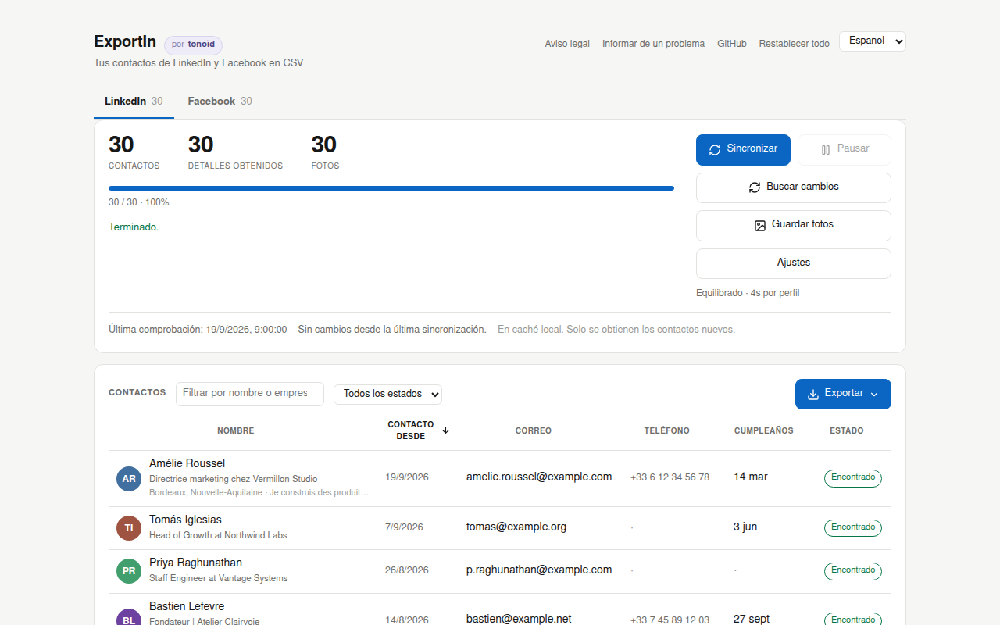
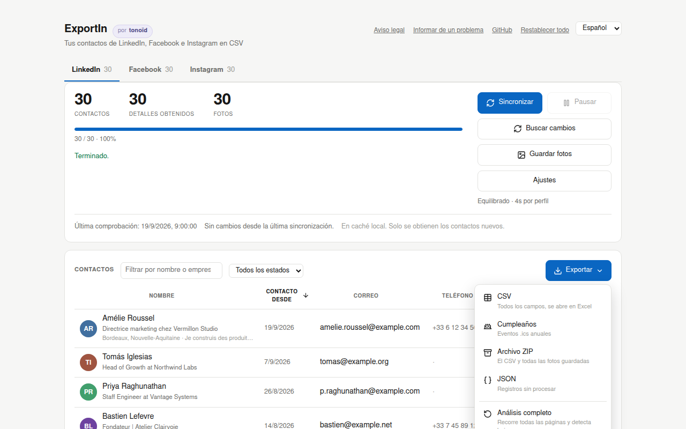

<div align="center">

# ExportIn

**Una extensión de Chrome que saca de LinkedIn y Facebook los cumpleaños de tus contactos, con sus datos de contacto, para que un agente de IA enriquezca tu CRM. Felicita a la gente el mismo día y retoma el contacto con quienes has perdido de vista. Gratuita y de código abierto.**

[](LICENSE)
[](https://www.tonoid.com)

[English](README.md) · [Français](README_FR.md) · Español

[Aviso legal](#aviso-legal) · [Instalación](#instalación) · [Uso](#uso) · [Qué obtienes](#qué-obtienes) · [Cómo funciona](#cómo-funciona) · [Cuando algo se rompe](#cuando-linkedin-o-facebook-cambian-algo) · [Preguntas frecuentes](#preguntas-frecuentes)

</div>

---

## Aviso legal

**Lee esto antes de instalar. La extensión te lo vuelve a preguntar la primera vez que la abres.**

**Condiciones de uso.** ExportIn automatiza peticiones que tu navegador ya hace cuando navegas por LinkedIn y Facebook. Aun así, la recopilación automatizada va contra las condiciones de uso de ambos, y se han restringido y suspendido cuentas por ello. El ritmo por defecto es lento a propósito. Eso reduce el riesgo; no lo elimina.

**Datos personales.** Lo que exportas son datos personales de otras personas. Una vez en tu CRM, eres responsable de ellos según el RGPD y leyes similares: una finalidad legítima, un plazo de conservación y el derecho de acceso y supresión. Estas personas aceptaron ser tus contactos, no entrar en tu lista de clientes potenciales. Facebook añade el año de nacimiento cuando un amigo lo comparte, lo que da una edad exacta. Trátalo como un dato sensible. Dar el archivo a un servicio de IA es compartirlo con ese servicio, así que comprueba dónde se ejecuta y qué conserva.

**Sin garantía.** El software se ofrece tal cual. tonoïd no se hace responsable de una cuenta restringida, de datos perdidos ni de ningún otro daño derivado de su uso. Consulta la [licencia MIT](LICENSE).

---

## Por qué

Un cumpleaños es la excusa más fácil para retomar el contacto con alguien. Lo difícil es saber cuándo. LinkedIn y Facebook conocen los cumpleaños de tus contactos, y ninguno de los dos te deja sacarlos.

- La exportación oficial de LinkedIn (Preferencias, Privacidad de datos, Obtener una copia de tus datos) da nombres, empresas, cargos, la fecha de conexión y a veces un correo. **Ni cumpleaños, ni teléfonos, ni fotos.** Esos datos están en el panel Información de contacto de cada perfil, un perfil cada vez.
- La descarga de datos de Facebook lista a tus amigos y la fecha en que empezó la amistad. Ni cumpleaños ni foto.

ExportIn saca todos los cumpleaños que encuentra en las dos redes, con los datos que los acompañan, en un CSV por red. Los dos archivos comparten las mismas columnas de cumpleaños. Están pensados para alimentar a un agente de IA que enriquezca tu CRM: reconocer a la misma persona en LinkedIn y Facebook, completar su cumpleaños, redactar un mensaje ese día, señalar a la gente con la que no hablas desde hace un año. Dejas de enterarte de un cumpleaños por una notificación al día siguiente.

Algunas decisiones hacen que un agente lea los archivos sin esfuerzo. Las fechas están en ISO (`1988-03-14`), con el día, el mes y el año también en columnas separadas, para que nada tenga que adivinar qué significa `03/04`. En LinkedIn, la sección Acerca de, opcional, añade lo que la persona cuenta de su trabajo, algo real con lo que escribir. Si solo quieres recordatorios, la exportación Cumpleaños convierte las mismas fechas en un calendario anual.

ExportIn no llama a ninguna IA y no envía nada a ningún sitio. Recopila a un ritmo lento y ajustable y lo guarda todo en tu navegador, sin cuenta, sin servidor y sin telemetría. A qué agente le das el archivo, si se lo das, lo decides tú.

<div align="center">
  
  <br><sub>Todos los nombres, caras y direcciones de estas capturas son inventados.</sub>
</div>

---

## Instalación

**[Instalar desde la Chrome Web Store](https://chromewebstore.google.com/detail/leninmleheiaooeecleicccbceiahlhi)**. La ficha está en revisión; mientras no se publique, el enlace muestra una página vacía. Mientras tanto, descarga `exportin-1.0.0.zip` desde la [última versión](https://github.com/tonoid/ExportIn/releases/latest), o carga el código fuente en modo desarrollador:

```bash
git clone https://github.com/tonoid/ExportIn
```

1. Ve a `chrome://extensions/`
2. Activa el **Modo de desarrollador** (arriba a la derecha)
3. Haz clic en **Cargar descomprimida** y selecciona la carpeta **`ExportIn/dist/`**

Carga `dist/`, no la raíz del repositorio. El panel se abre solo después de instalar, y otra vez después de cada actualización.

---

## Uso

Haz clic en el icono de la barra de herramientas. ExportIn se abre en **su propia pestaña**, no en una ventana emergente, así que puedes seguir el progreso mientras trabajas en otra cosa. Tiene una pestaña por red, y las dos pueden recopilar a la vez. Un anillo en cada pestaña muestra el progreso de una tarea que no estás mirando.

Las peticiones salen de una pestaña de LinkedIn o Facebook que ExportIn abre **en segundo plano** y nunca pasa al primer plano. Cerrar esa pestaña pone la tarea en pausa.

| Botón | Qué hace |
| --- | --- |
| **Empezar** / **Reanudar** | primera recopilación completa, o continúa donde se detuvo |
| **Sincronizar** | obtiene solo lo que ha cambiado desde la última vez |
| **Buscar cambios** | lista los contactos nuevos y modificados sin obtener sus detalles |
| **Guardar fotos** | descarga los avatares y los guarda en local |
| **Pausar** | se detiene después de la petición en curso |

El botón principal cambia de nombre para decir lo que va a hacer de verdad. El menú Exportar también tiene **Análisis completo**, que recorre todas las páginas para encontrar a quienes te han eliminado, y **Borrar los datos** de la red que está en pantalla. **Restablecer todo**, en la parte superior del panel, borra las dos redes, las fotos y los ajustes tras una advertencia.

### La tabla

Cada contacto aparece con su foto, nombre, titular y detalles, 40 por página. Haz clic en el encabezado de una columna para ordenar, y otra vez para invertir el orden. Las celdas vacías siempre quedan al final. Un cuadro de búsqueda y un filtro de estado acotan la lista.

| Estado | Significado |
| --- | --- |
| Pendiente | en cola, detalles aún no obtenidos (LinkedIn) |
| Encontrado | al menos un correo, teléfono, cumpleaños o sitio web; en Facebook, un cumpleaños |
| Nada | obtenido sin problemas, la persona no comparte nada |
| Sin acceso | LinkedIn ha denegado este perfil; el motivo está en la descripción emergente |
| Eliminado | ausente de la lista en el último análisis completo |

Los cumpleaños se muestran en el idioma del panel en las dos pestañas: "Mar 14", "14 mars", "14 mar".

### Exportaciones

<div align="center">
  
</div>

| Formato | Contenido |
| --- | --- |
| **CSV** | todos los campos, en UTF-8 con BOM y CRLF para que Excel lo abra sin problemas |
| **Cumpleaños** | un archivo `.ics` de eventos que se repiten cada año |
| **Archivo ZIP** | el CSV más `photos/<id>.jpg` |
| **JSON** | los registros sin procesar |

Una exportación siempre incluye todos los contactos de esa pestaña, no la página ni el filtro que hay en pantalla. ExportIn escapa las celdas que empiezan por `=`, `+`, `-` o `@`, así que una hoja de cálculo nunca las ejecuta como fórmulas.

**Los nombres de columna siguen el idioma del panel.** Una exportación en francés escribe `prenom,nom,date_anniv,...`, y una en español `nombre,apellido,fecha_cumple,...`. Solo cambia la fila de encabezado; los valores son los mismos en todos los idiomas. Por eso, cambiar el idioma cambia la correspondencia de columnas que recuerda tu CRM.

**Los cumpleaños van en formato ISO.** `dateBday` es `1988-03-14` con el año y `03-14` sin él. `14/03` y `03/14` se leen de forma distinta en dos países, y una importación al CRM nunca pregunta cuál querías decir. `dayBday`, `monthBday` y `yearBday` guardan la misma fecha como números separados. Las dos redes exportan estas cuatro columnas, así que una sola correspondencia en el CRM importa cualquiera de los dos archivos.

---

## Qué obtienes

### LinkedIn

| Columna | Origen | Nota |
| --- | --- | --- |
| firstName, lastName, headline | lista de contactos | siempre presente |
| connectedOn | lista de contactos | fecha exacta |
| profileUrl, publicId, memberUrn | lista de contactos | siempre presente |
| title | deducido del titular | empresa exacta con la opción de abajo |
| company, location, connections | perfil, opcional | "Puesto y ubicación exactos" en Ajustes |
| about | sección Acerca de, opcional | "Sección Acerca de" en Ajustes; conserva los párrafos |
| email | panel Información de contacto | solo si la persona lo comparte |
| phone, website, address, twitter, im | panel Información de contacto | solo si se comparte |
| dateBday, dayBday, monthBday | panel Información de contacto | `yearBday` queda vacío, LinkedIn nunca muestra el año |
| photoUrl | lista de contactos | enlace firmado que caduca, ver [Fotos](#fotos) |
| firstSeen, lastSeen, removed, note | caché local | seguimiento de cambios; `note` guarda el motivo de "Sin acceso" |

La mayoría de la gente no comparte nada en su panel Información de contacto. Cuenta con muchas celdas vacías. Es su configuración de privacidad, no un error.

Cada una de las dos opciones de Ajustes añade una petición por perfil, así que cada una duplica más o menos el tiempo. Las dos vienen desactivadas por defecto.

### Facebook

| Columna | Origen | Nota |
| --- | --- | --- |
| firstName, lastName | separados a partir del nombre | Facebook solo guarda un nombre para mostrar |
| name | tal cual | el nombre completo, nunca reconstruido |
| dateBday, dayBday, monthBday | cumpleaños | día y mes como números |
| yearBday | cumpleaños | solo si el amigo lo comparte |
| age | calculado | vacío sin el año |
| mutualFriends | lista de amigos | un número: "12 amigos en común" pasa a ser 12 |
| gender, profileUrl, photoUrl, facebookId | ambos | siempre presente |
| firstSeen, lastSeen, removed | caché local | seguimiento de cambios |

En una cuenta real de 1486 amigos, el 80% tenía un cumpleaños visible y el 45% de esos también mostraba el año. Comprobamos a mano que los años que faltan están ocultos de verdad. En una muestra aleatoria, la página Información del perfil muestra la fecha y no el año. No hay una pasada extra para buscarlos porque no hay nada que encontrar.

Facebook no expone el correo, el teléfono, el empleo ni la ciudad de los amigos. Llegamos a crear una pasada que leía el empleo y la ciudad de la tarjeta emergente de cada amigo, y luego la quitamos. Costaba una petición por amigo y horas para una cuenta normal, para una línea que la mayoría de los amigos deja vacía.

---

## Cómo funciona

ExportIn reproduce las peticiones que hacen las propias aplicaciones web de LinkedIn y Facebook, desde una pestaña en la que ya has iniciado sesión. No extrae el contenido de las páginas que ves.

### LinkedIn

```
┌─ La lista de contactos ───────────────────────────────────────────┐
│ GET /voyager/api/relationships/dash/connections                   │
│ 40 por página, los más recientes primero                          │
│ → nombre, titular, foto, id público, fecha exacta                 │
└──────────────────────────┬────────────────────────────────────────┘
                           │  una petición por persona nueva
                           ▼
┌─ El panel Información de contacto ────────────────────────────────┐
│ POST /flagship-web/rsc-action/actions/navigation                  │
│      ?screenId=...profile.ProfileContactDetailsOverlay            │
│ → correo, teléfono, cumpleaños, sitio web, Twitter                │
└──────────────────────────┬────────────────────────────────────────┘
                           │  opcional, una petición cada una
                           ▼
┌─ Perfil y Acerca de ──────────────────────────────────────────────┐
│ la pantalla del perfil → empresa, ubicación, nº de contactos      │
│ actions/component?componentId=...profileCardsAboveActivity        │
│   → el texto de Acerca de                                         │
└───────────────────────────────────────────────────────────────────┘
```

La respuesta de Información de contacto es un flujo React Flight, no JSON. Cada fila del panel aparece como una etiqueta seguida de su valor, así que el analizador busca por etiqueta, en inglés, francés y español. Buscar por posición se desfasaría sin avisar, porque un perfil omite las filas que no ha rellenado.

### Facebook

Facebook solo sirve consultas GraphQL persistidas. Con dos basta.

```
┌─ 1. El año de cumpleaños ─────────────────────────────────────────┐
│ POST /api/graphql/  BirthdayCometMonthlyBirthdaysRefetchQuery     │
│ → nombre, foto, perfil, día, mes y año                            │
│ unas 6 peticiones para todo el año, tengas los amigos que tengas  │
└──────────────────────────┬────────────────────────────────────────┘
                           ▼
┌─ 2. La lista de amigos ───────────────────────────────────────────┐
│ FriendingCometFriendsListPaginationQuery                          │
│ 30 por página; recoge a los amigos que ocultan su cumpleaños      │
└───────────────────────────────────────────────────────────────────┘
```

Para 2000 amigos son unas 75 peticiones y unos pocos minutos. Pagas por mes y por página de 30, nunca por persona, lo que hace de Facebook la más barata de las dos redes.

**No hay ningún `doc_id` escrito en el código.** Una consulta persistida se identifica por un `doc_id` que Facebook renumera en cada despliegue, a veces varias veces por semana. Uno escrito a mano funcionaría unos días y luego fallaría sin avisar. Por eso ExportIn lo lee de la página cada vez:

- `fb-hook.js` se ejecuta en el propio entorno JavaScript de la página (`"world": "MAIN"`). Observa las llamadas GraphQL que envía la página y se las pasa a la extensión.
- El código de la página ya guarda el `doc_id` de cada consulta en un módulo, mucho antes de enviar la consulta. El hook lo lee del registro de módulos de la página, y la extensión construye la petición a partir del envoltorio de cualquier llamada que la página sí haya enviado (token, sesión y parámetros de compilación), cambiando solo el nombre, el `doc_id` y las variables.

El segundo paso es lo que permite que funcione una pestaña en segundo plano. Una pestaña que no estás mirando no se dibuja ni se desplaza, así que Facebook nunca pide el mes siguiente por sí solo. En una cuenta real, una pestaña en segundo plano envió 12 llamadas GraphQL y ninguna era la consulta de cumpleaños. Si falta el módulo, ExportIn recurre a desplazar la página, lo que solo funciona en una pestaña visible.

### Caché y sincronización

Todo lo recopilado se queda en disco y nunca se vuelve a pedir. La lista de LinkedIn está ordenada por contacto más reciente, así que las personas nuevas siempre están en la primera página. Después de la primera recopilación completa, **Sincronizar** lee la primera página y se detiene si no hay nada nuevo en ella. En una semana tranquila, eso es una sola petición.

| Acción | Coste | Encuentra |
| --- | --- | --- |
| Empezar, Reanudar, Sincronizar | solo personas nuevas | contactos nuevos, y luego sus detalles |
| Buscar cambios | normalmente 1 petición | personas nuevas y renombradas |
| Análisis completo | 1 petición por cada 40 contactos | también a quienes te han eliminado |

Las bajas necesitan el recorrido completo, porque la ausencia en la lista es la única señal que da cualquiera de las dos redes. Un recorrido parcial nunca informa de bajas.

En Facebook, ni siquiera un recorrido completo es una prueba. En una cuenta real, la lista de amigos se detuvo en 1417 de 1486 y aun así se declaró completa, y la mayoría de los amigos que se saltó acababan de aparecer en el barrido de cumpleaños. Por eso se conserva a todo amigo que devuelve ese barrido, y un amigo sin cumpleaños solo se marca como eliminado si la lista no se saltó a ninguno de los amigos confirmados por los cumpleaños.

### Ritmo y paradas de seguridad

LinkedIn tiene tres ritmos con nombre: **Prudente** (7 s por perfil), **Equilibrado** (4 s, el predeterminado) y **Rápido** (2 s), además de la opción "Espera personalizada". El panel muestra una velocidad medida y una hora de fin, como `14 perfiles/min · quedan 1h 7min · listo hacia 22:12`, a partir del progreso real de los últimos cinco minutos. Cada petición lleva una variación aleatoria de ±40%.

El ritmo se adapta solo. Una petición que hay que reintentar alarga la espera y una limpia la relaja, hasta cinco veces el valor elegido y nunca por debajo de él.

Ante un HTTP 429, un 999 o una redirección a un control de seguridad, la tarea **se detiene** en lugar de esperar y reintentar. Un control de seguridad significa que la red ya ha notado algo, e insistir lo empeora. Un 403 en un solo perfil solo significa que esa persona ha cerrado sus datos. ExportIn lo anota y la tarea sigue.

Si la pestaña de trabajo muere o deja de responder durante 30 segundos, el panel reinicia la tarea por sí solo, hasta cinco veces, y nunca después de una de las paradas anteriores.

### Fotos

El `photoUrl` de LinkedIn es un enlace de CDN firmado que caduca al cabo de unos meses. Una foto solo es tuya cuando los bytes están en disco, así que **Guardar fotos** las descarga en IndexedDB. El propio panel las descarga, de cuatro en cuatro, desde `media.licdn.com` y `fbcdn.net`. Son archivos de imagen normales que se descargan sin tu sesión, así que no tienen ninguno de los riesgos de las llamadas a la API.

Las fotos de Facebook llegan como máximo a 120 píxeles. La URL está firmada, y si cambias su parámetro de tamaño, Facebook rechaza la imagen.

---

## Cuando LinkedIn o Facebook cambian algo

Pasará. Esto es lo que hace la extensión al respecto, y lo que no puede hacer.

**Lo que se repara solo.** Los `doc_id` de Facebook, porque se leen de la página cada vez. Cuando una consulta reproducida no devuelve a nadie en la primera página, ExportIn la descarta y la vuelve a aprender.

**Lo que no.** Si LinkedIn elimina un endpoint o cambia el nombre de una etiqueta, ningún código puede adivinar el nuevo. Lo que hace la extensión es **detectarlo rápido, dejar de malgastar peticiones y avisar**.

Un scraper roto no falla con un error. Recibe un `200 OK` cuya forma ya no entiende, y eso se parece exactamente a una serie de personas muy celosas de su privacidad. La única diferencia es la frecuencia con que ocurre. Por eso cada paso cuenta cuántas peticiones han tenido éxito y cuántas han producido algo de verdad.

| Sonda | Se evalúa tras | Mínimo |
| --- | --- | --- |
| `list`, `birthdays`, `friends` | 2 peticiones | 40% |
| `contact`, `profile`, `about` | de 20 a 40 peticiones | 0% |

Una página de la lista casi siempre debería devolver personas, así que bastan dos fallos. Los datos de contacto están vacíos para la mayoría de la gente. Tres respuestas con datos de cada sesenta son datos reales, mientras que cuarenta respuestas vacías seguidas son un cambio de formato.

Cuando salta una sonda, **la tarea se detiene**. Si no, dos mil personas quedarían marcadas como terminadas con los campos vacíos, y tendrías que borrarlo todo cuando saliera una corrección. El panel indica qué paso ha fallado y ofrece un botón que abre una incidencia de GitHub ya rellenada.

**El informe no contiene datos personales.** Nadie revisa un informe de error antes de enviarlo, así que la garantía no puede depender de ti. ExportIn construye el informe solo con contadores. Ningún registro, nombre, identificador ni token llega nunca a ese código, y una prueba le pasa datos hostiles para comprobarlo.

```
ExportIn 1.0.0 | linkedin | ui en
date 2026-09-23
phase contact | error broken
detail contact

probe            attempts  yields  verdict
list                    6       6  ok
contact                40       0  broken
```

**Informar de un problema**, en la parte superior del panel, abre el mismo tipo de informe para cualquier otro problema.

---

## Privacidad

- **Sin cuenta, sin inicio de sesión, sin telemetría.**
- **No se envía nada a ningún servidor.** No hay servidor. La extensión solo contacta con `linkedin.com`, `media.licdn.com`, `facebook.com` y `fbcdn.net`, con tu propia sesión.
- **Solo almacenamiento local:** `chrome.storage.local` para los registros, IndexedDB para las fotos.
- El panel construye la tabla con `textContent`, nunca con `innerHTML`. Los nombres y los titulares son texto escrito por otras personas, y el panel tiene privilegios `chrome.*`.

---

## Limitaciones conocidas

- **Solo Chrome** por ahora.
- **Tiene que quedar abierta una pestaña de LinkedIn o Facebook.** La tarea se ejecuta en un content script, porque Manifest V3 detiene un service worker tras unos 30 segundos de inactividad, y esta tarea espera entre peticiones a propósito.
- **`title` se deduce del titular de texto libre** salvo que "Puesto y ubicación exactos" esté activado. `CTO at Acme` se separa bien; `Building things | ex-Google` no. ExportIn siempre conserva el titular original.
- **LinkedIn nunca muestra el año de nacimiento.**
- **Los enlaces de foto de LinkedIn caducan.** Un análisis completo los renueva, y luego Guardar fotos descarga lo que falte.

---

## Desarrollo

```bash
git clone https://github.com/tonoid/ExportIn
cd ExportIn
node test.mjs              # sin dependencias
./scripts/build.sh         # → build/exportin-<version>.zip
./scripts/screenshots.sh   # → docs/screenshots, necesita chrome-headless-shell
```

Manifest V3, JavaScript puro, sin paso de compilación, sin framework, sin dependencias en tiempo de ejecución.

```
dist/                  # lo que carga Chrome
  manifest.json
  lib.js               # funciones puras, compartidas con las pruebas
  content.js           # worker de LinkedIn, se ejecuta en la pestaña de LinkedIn
  fb-hook.js           # Facebook, entorno de la página: observa sus llamadas GraphQL
  content-facebook.js  # worker de Facebook, entorno de la extensión
  panel.html, panel.js # la interfaz
  sw.js                # abre la pestaña del panel
  i18n.js              # textos en inglés, francés y español
  photos.js            # almacén de fotos en IndexedDB
  zip.js               # generador de ZIP
  icons.js, icons/
demo/                  # chrome.* falso y datos inventados para las capturas
docs/screenshots/
scripts/               # compilación y capturas
test.mjs
```

**Las capturas muestran el panel real.** `demo/build.mjs` construye una página a partir de `dist/panel.html` y añade `demo/mock.js`, que sustituye `chrome.*` por imitaciones en memoria y llena la caché de personas inventadas. Las capturas no pueden desviarse del producto, y ningún dato real se ha acercado nunca a esa carpeta.

**Pruebas.** `node test.mjs` ejecuta unas cien comprobaciones: los analizadores de Flight y GraphQL, la conciliación de la caché, el escapado del CSV, la lectura de cumpleaños en tres idiomas, la ordenación, el generador de ZIP, la salida ICS, las sondas de fallos y la privacidad del informe. Algunas comprobaciones leen el marcado en lugar del código, porque ahí es donde se esconden las erratas. Cada columna ordenable debe corresponder a una clave de ordenación real, y los tres idiomas deben definir exactamente los mismos textos.

**Idiomas.** Inglés, francés y español, según el idioma del navegador por defecto. Los textos están en `i18n.js` y no en `_locales`, porque `chrome.i18n` sigue el idioma del propio Chrome y no se puede cambiar desde la página.

---

## Preguntas frecuentes

### ¿Es legal?
Accedes a datos que LinkedIn y Facebook ya te muestran, con tu propia sesión, sobre tus propios contactos. Pero automatizar ese acceso incumple las condiciones de uso de ambos, y los datos pertenecen a otras personas. Lee primero el [aviso legal](#aviso-legal).

### ¿Me bloquearán la cuenta?
A un ritmo lento y a escala personal estás en la parte baja del riesgo, no en cero. ExportIn se detiene a la primera señal de limitación de peticiones o de un control de seguridad, en lugar de insistir. Un ritmo más lento reduce aún más el riesgo.

### ¿Por qué no usar la exportación oficial de LinkedIn?
Úsala si te bastan los nombres, empresas, cargos, fechas de conexión y correos. Es gratuita, inmediata y no tiene ningún riesgo. ExportIn existe por los cumpleaños, teléfonos y fotos que esa exportación deja fuera.

### ¿Por qué hay tantas columnas vacías?
La mayoría de la gente no comparte ni su teléfono, ni su cumpleaños, ni su correo. Es su configuración de privacidad.

### ¿Funciona en Firefox?
Todavía no.

### ¿Cómo informo de un error?
Haz clic en **Informar de un problema** en la parte superior del panel, o [abre una incidencia](https://github.com/tonoid/ExportIn/issues/new). Las pull requests son bienvenidas. Los commits siguen [Conventional Commits](https://www.conventionalcommits.org/); ejecuta `node test.mjs` antes de hacer push.

---

## Licencia

[MIT](LICENSE) © [tonoïd](https://www.tonoid.com)

Puedes hacer un fork, modificarlo, redistribuirlo y venderlo siempre que conserves el aviso de copyright. Sin obligación de compartir tus cambios, y sin garantía.

---

## Hecho por tonoïd

ExportIn es un proyecto de [tonoïd](https://www.tonoid.com), un estudio que crea micro-SaaS y herramientas de código abierto para particulares y profesionales independientes.

| Proyecto | Descripción |
| --- | --- |
| [**Immodex**](https://github.com/tonoid/immodex) | Encuentra la dirección real detrás de un anuncio inmobiliario francés, a partir de los registros territoriales de la ADEME y del IGN. |
| [**2sync**](https://2sync.com) | Sincronización bidireccional entre Notion y las herramientas que ya usas. |
| [**RefurbMe**](https://www.refurb.me) | El mayor comparador de precios de productos Apple reacondicionados. |
| [**Sens de la marche**](https://sensdelamarche.fr) | Comprueba si tu asiento del TGV francés va en el sentido de la marcha antes de reservar. |
| [**Tetris.Casa**](https://tetris.casa) | Dibuja un plano apilando bloques al estilo Tetris. |

Todos los proyectos en **[tonoid.com](https://www.tonoid.com)**.
