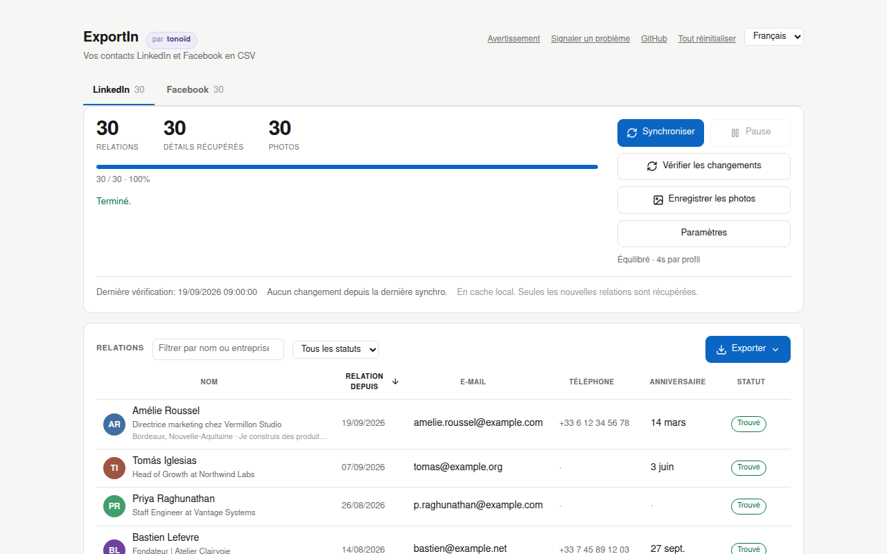
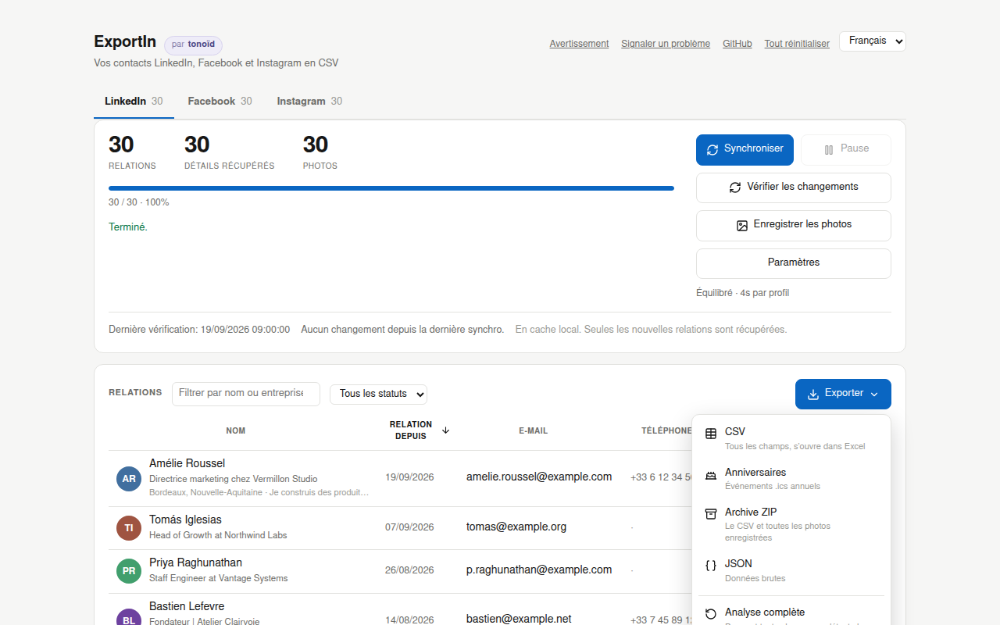
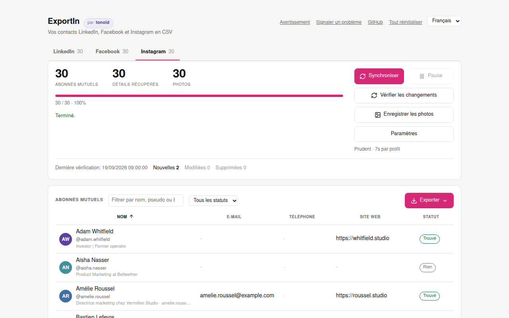

<div align="center">

# ExportIn

**Une extension Chrome qui sort de LinkedIn et de Facebook les anniversaires de vos contacts avec leurs coordonnées, et d'Instagram les coordonnées de vos abonnés mutuels, dans des fichiers CSV pour votre CRM. Tout reste dans votre navigateur. À qui écrire, et quoi dire, c'est vous qui décidez. Gratuite et open source.**

[](LICENSE)
[](https://www.tonoid.com/fr)

[English](README.md) · Français · [Español](README_ES.md)

[Avertissement](#avertissement) · [Installation](#installation) · [Utilisation](#utilisation) · [Ce que vous obtenez](#ce-que-vous-obtenez) · [Fonctionnement](#fonctionnement) · [Quand ça casse](#quand-un-réseau-change-quelque-chose) · [FAQ](#faq)

</div>

---

## Avertissement

**À lire avant d'installer. L'extension vous le redemande au premier lancement.**

**Conditions d'utilisation.** ExportIn automatise des requêtes que votre navigateur fait déjà quand vous consultez LinkedIn, Facebook et Instagram. La collecte automatisée reste contraire aux conditions d'utilisation de ces trois services, et des comptes ont été restreints et suspendus pour cette raison. Le rythme par défaut est volontairement lent. Cela réduit le risque ; cela ne le supprime pas.

**Données personnelles.** Ce que vous exportez, ce sont les données personnelles d'autres personnes. Une fois qu'elles sont dans votre CRM, vous en êtes responsable au sens du RGPD et des lois similaires : une finalité légitime, une durée de conservation, le droit d'accès et d'effacement. Ces personnes ont accepté d'être dans vos relations, pas d'entrer dans votre liste de prospects. Facebook ajoute l'année de naissance quand un ami la partage, ce qui donne un âge exact. Traitez-la comme une donnée sensible. Confier le fichier à un service d'IA, c'est le partager avec ce service : vérifiez où il tourne et ce qu'il conserve.

**Aucune garantie.** Le logiciel est fourni tel quel. tonoïd n'est pas responsable d'un compte restreint, de données perdues ou de tout autre dommage lié à son utilisation. Voir la [licence MIT](LICENSE).

---

## Pourquoi

Un anniversaire est la meilleure excuse pour reprendre contact avec quelqu'un. Le plus dur, c'est de savoir quand. LinkedIn et Facebook connaissent les anniversaires de vos contacts, et aucun des deux ne vous laisse les récupérer.

- L'export officiel de LinkedIn (Préférences, Confidentialité des données, Obtenir une copie de vos données) donne les noms, les entreprises, les postes, la date de mise en relation, et parfois un e-mail. **Ni anniversaires, ni téléphones, ni photos.** Ils se trouvent dans le panneau Coordonnées de chaque profil, un profil à la fois.
- Le téléchargement proposé par Facebook liste vos amis et la date à laquelle vous êtes devenus amis. Pas d'anniversaire, pas de photo.

ExportIn récupère tous les anniversaires qu'il trouve sur les deux réseaux, avec les informations qui les entourent, dans un CSV par réseau. Les deux fichiers partagent les mêmes colonnes d'anniversaire. Ils sont faits pour alimenter un agent IA qui enrichit votre CRM : reconnaître la même personne sur LinkedIn et Facebook, compléter son anniversaire, signaler les gens à qui vous n'avez pas parlé depuis un an. Vous n'apprenez plus un anniversaire par une notification le lendemain.

Instagram n'a pas d'anniversaires à donner. Son onglet exporte les personnes que vous suivez et qui vous suivent en retour, avec la bio, le lien, la catégorie, le nombre d'abonnés, et un e-mail s'il est écrit dans la bio. Cela suffit pour relier un pseudo Instagram à quelqu'un déjà présent dans votre CRM.

Quelques choix rendent les fichiers faciles à lire pour un agent. Les dates sont en ISO (`1988-03-14`), avec aussi le jour, le mois et l'année dans des colonnes séparées, pour que rien n'ait à deviner ce que veut dire `03/04`. Sur LinkedIn, la section Infos, en option, ajoute ce que la personne dit elle-même de son travail, de quoi écrire un vrai message. Si des rappels vous suffisent, l'export Anniversaires transforme les mêmes dates en calendrier annuel.

ExportIn n'appelle lui-même aucune IA et n'envoie rien nulle part. Il collecte à un rythme lent et réglable et garde tout dans votre navigateur, sans compte, sans serveur et sans télémétrie. À quel agent vous confiez le fichier, et si vous le faites, c'est votre choix.

<div align="center">
  
  <br><sub>Tous les noms, visages et adresses de ces captures sont inventés.</sub>
</div>

---

## Installation

**[Installer depuis le Chrome Web Store](https://chromewebstore.google.com/detail/leninmleheiaooeecleicccbceiahlhi)**. Ou téléchargez `exportin-1.1.0.zip` depuis la [dernière version](https://github.com/tonoid/ExportIn/releases/latest), ou chargez le code source en mode développeur :

```bash
git clone https://github.com/tonoid/ExportIn
```

1. Allez sur `chrome://extensions/`
2. Activez le **Mode développeur** (en haut à droite)
3. Cliquez sur **Charger l'extension non empaquetée** et sélectionnez le dossier **`ExportIn/dist/`**

Chargez `dist/`, pas la racine du dépôt. Le panneau s'ouvre tout seul après l'installation, puis après chaque mise à jour.

---

## Utilisation

Cliquez sur l'icône dans la barre d'outils. ExportIn s'ouvre dans **son propre onglet**, pas dans une popup, pour que vous puissiez suivre la progression pendant que vous travaillez ailleurs. Il a un onglet par réseau, et tous peuvent collecter en même temps. Un anneau sur chaque onglet montre la progression d'une tâche que vous ne regardez pas.

Les requêtes partent d'un onglet LinkedIn, Facebook ou Instagram qu'ExportIn ouvre **en arrière-plan** et ne met jamais au premier plan. Fermer cet onglet met la tâche en pause.

| Bouton | Ce qu'il fait |
| --- | --- |
| **Démarrer** / **Reprendre** | première collecte complète, ou reprise là où elle s'était arrêtée |
| **Synchroniser** | récupère seulement ce qui a changé depuis la dernière fois |
| **Vérifier les changements** | liste les contacts nouveaux et modifiés sans récupérer leurs détails |
| **Enregistrer les photos** | télécharge les avatars et les garde en local |
| **Pause** | s'arrête après la requête en cours |

Le bouton principal change de libellé pour indiquer ce qu'il va vraiment faire. Le menu « Exporter » propose aussi **Analyse complète**, qui parcourt toutes les pages pour trouver les personnes qui vous ont retiré, et **Effacer les données** pour le réseau affiché. **Tout réinitialiser**, en haut du panneau, efface tous les réseaux, les photos et les réglages après un avertissement.

### Le tableau

Chaque contact apparaît avec sa photo, son nom, son titre et ses détails, 40 par page. Cliquez sur un en-tête de colonne pour trier, cliquez encore pour inverser l'ordre. Les cellules vides sont toujours triées en dernier. Un champ de recherche et un filtre de statut réduisent la liste.

| Statut | Signification |
| --- | --- |
| En attente | en file d'attente, détails pas encore récupérés (LinkedIn, Instagram) |
| Trouvé | au moins un e-mail, un téléphone, un anniversaire ou un site web ; sur Facebook, un anniversaire |
| Rien | récupéré sans erreur, la personne ne partage rien |
| Pas d’accès | le réseau a refusé ce profil, ou il n'existe plus ; la raison est dans l'infobulle |
| Supprimée | absente de la liste lors de la dernière analyse complète |

Les anniversaires s'affichent dans la langue du panneau sur les deux onglets : "Mar 14", "14 mars", "14 mar".

### Exports

<div align="center">
  
</div>

| Format | Contenu |
| --- | --- |
| **CSV** | tous les champs, en UTF-8 avec BOM et CRLF pour qu'Excel l'ouvre proprement |
| **Anniversaires** | un fichier `.ics` d'événements annuels récurrents |
| **Archive ZIP** | le CSV plus `photos/<id>.jpg` |
| **JSON** | les enregistrements bruts |

Un export couvre toujours tous les contacts de l'onglet, pas la page ou le filtre affiché. ExportIn échappe les cellules qui commencent par `=`, `+`, `-` ou `@` pour qu'un tableur ne les exécute jamais comme des formules.

**Les noms de colonnes suivent la langue du panneau.** Un export en français écrit `prenom,nom,date_anniv,...`, un export en espagnol `nombre,apellido,fecha_cumple,...`. Seule la ligne d'en-tête change ; les valeurs sont les mêmes dans toutes les langues. Changer de langue change donc la correspondance de colonnes que votre CRM a mémorisée.

**Les anniversaires sont au format ISO.** `dateBday` vaut `1988-03-14` avec l'année et `03-14` sans. `14/03` et `03/14` se lisent différemment d'un pays à l'autre, et un import CRM ne vous demande jamais ce que vous vouliez dire. `dayBday`, `monthBday` et `yearBday` contiennent la même date en nombres séparés. LinkedIn et Facebook exportent tous deux ces quatre colonnes, donc une seule correspondance dans le CRM importe l'un ou l'autre fichier. Instagram n'a pas de colonnes d'anniversaire.

---

## Ce que vous obtenez

### LinkedIn

| Colonne | Source | Remarque |
| --- | --- | --- |
| firstName, lastName, headline | liste des relations | toujours présent |
| connectedOn | liste des relations | date exacte |
| profileUrl, publicId, memberUrn | liste des relations | toujours présent |
| title | déduit du titre du profil | entreprise exacte avec l'option ci-dessous |
| company, location, connections | profil, optionnel | « Poste et localisation exacts » dans Paramètres |
| about | section Infos, optionnel | « Section Infos » dans Paramètres ; paragraphes conservés |
| email | panneau Coordonnées | seulement si la personne le partage |
| phone, website, address, twitter, im | panneau Coordonnées | seulement si partagé |
| dateBday, dayBday, monthBday | panneau Coordonnées | `yearBday` reste vide, LinkedIn n'affiche jamais l'année |
| photoUrl | liste des relations | lien signé qui expire, voir [Photos](#photos) |
| firstSeen, lastSeen, removed, note | cache local | suivi des changements ; `note` contient la raison de « Pas d’accès » |

La plupart des gens ne partagent rien dans leur panneau Coordonnées. Attendez-vous à beaucoup de cellules vides. C'est leur réglage de confidentialité, pas un bug.

Les deux options des Paramètres ajoutent chacune une requête par profil, donc chacune double à peu près la durée. Les deux sont désactivées par défaut.

### Facebook

| Colonne | Source | Remarque |
| --- | --- | --- |
| firstName, lastName | découpés depuis le nom | Facebook ne stocke qu'un nom d'affichage |
| name | tel quel | le nom complet, jamais reconstruit |
| dateBday, dayBday, monthBday | anniversaires | jour et mois en nombres |
| yearBday | anniversaires | seulement si l'ami la partage |
| age | calculé | vide sans l'année |
| mutualFriends | liste d'amis | un nombre, "12 amis en commun" devient 12 |
| gender, profileUrl, photoUrl, facebookId | les deux | toujours présent |
| firstSeen, lastSeen, removed | cache local | suivi des changements |

Sur un vrai compte de 1486 amis, 80% avaient un anniversaire visible et 45% d'entre eux affichaient aussi l'année. Nous avons vérifié à la main que les années manquantes sont vraiment masquées. Sur un échantillon aléatoire, la page « À propos » du profil affiche la date, pas l'année. Il n'y a pas de passe supplémentaire pour les trouver, parce qu'il n'y a rien à trouver.

Facebook n'expose ni e-mail, ni téléphone, ni poste, ni ville pour les amis. Nous avons construit puis retiré une passe qui lisait le poste et la ville dans la carte de survol de chaque ami. Elle coûtait une requête par ami, donc des heures pour un compte normal, pour une ligne que la plupart des amis laissent vide.

### Instagram

Seulement les abonnés mutuels, c'est-à-dire les personnes que vous suivez et qui vous suivent aussi. Un abonnement à sens unique est bien plus souvent une marque ou un inconnu que quelqu'un que vous connaissez.

<div align="center">
  
</div>

| Colonne | Source | Note |
| --- | --- | --- |
| firstName, lastName | découpés depuis le nom | Instagram ne stocke qu'un nom d'affichage |
| name, username, profileUrl, instagramId | liste des abonnements | toujours présents |
| verified, private | liste des abonnements | `yes` ou vide |
| bio, category, followers | profil | une requête par abonné mutuel |
| email | profil | un e-mail écrit dans la bio |
| phone | profil | presque toujours vide ; la requête du profil ne contient aucun contact professionnel |
| website | profil | le lien du profil, ou le premier lien de la bio |
| photoUrl | profil | lien signé qui expire |
| firstSeen, lastSeen, removed, note | cache local | suivi des changements ; `note` contient la raison de « Pas d’accès » |

Instagram n'a aucun champ d'anniversaire, donc cet onglet n'a pas d'export de calendrier. La plupart des comptes personnels ne publient ni e-mail ni téléphone. Attendez-vous à « Rien » sur la plupart des lignes, avec la bio et le lien quand même remplis.

---

## Fonctionnement

ExportIn rejoue les requêtes que les applications web de LinkedIn, Facebook et Instagram font elles-mêmes, depuis un onglet où vous êtes déjà connecté. Il ne scrape pas les pages que vous voyez.

### LinkedIn

```
┌─ La liste des relations ──────────────────────────────────────────┐
│ GET /voyager/api/relationships/dash/connections                   │
│ 40 par page, les plus récentes d'abord                            │
│ → nom, titre, photo, identifiant public, date exacte              │
└──────────────────────────┬────────────────────────────────────────┘
                           │  une requête par nouvelle personne
                           ▼
┌─ Le panneau Coordonnées ──────────────────────────────────────────┐
│ POST /flagship-web/rsc-action/actions/navigation                  │
│      ?screenId=...profile.ProfileContactDetailsOverlay            │
│ → e-mail, téléphone, anniversaire, site web, Twitter              │
└──────────────────────────┬────────────────────────────────────────┘
                           │  optionnel, une requête chacun
                           ▼
┌─ Profil et Infos ─────────────────────────────────────────────────┐
│ l'écran du profil → entreprise, localisation, nombre de relations │
│ actions/component?componentId=...profileCardsAboveActivity        │
│   → le texte de la section Infos                                  │
└───────────────────────────────────────────────────────────────────┘
```

La réponse du panneau Coordonnées est un flux React Flight, pas du JSON. Chaque ligne du panneau apparaît comme un libellé suivi de sa valeur, donc le parseur fait la correspondance par libellé, en anglais, en français et en espagnol. Une correspondance par position se décalerait sans aucune erreur, parce qu'un profil omet les lignes qu'il n'a pas remplies.

### Facebook

Facebook ne sert que des requêtes GraphQL persistées. Deux suffisent.

```
┌─ 1. L'année d'anniversaires ──────────────────────────────────────┐
│ POST /api/graphql/  BirthdayCometMonthlyBirthdaysRefetchQuery     │
│ → nom, photo, profil, jour, mois et année                         │
│ environ 6 requêtes pour toute l'année, quel que soit le nb d'amis │
└──────────────────────────┬────────────────────────────────────────┘
                           ▼
┌─ 2. La liste d'amis ──────────────────────────────────────────────┐
│ FriendingCometFriendsListPaginationQuery                          │
│ 30 par page ; rattrape les amis qui cachent leur anniversaire     │
└───────────────────────────────────────────────────────────────────┘
```

Pour 2000 amis, cela fait environ 75 requêtes et quelques minutes. Vous payez par mois et par page de 30, jamais par personne, ce qui fait de Facebook le moins coûteux des trois réseaux.

**Aucun `doc_id` n'est écrit dans le code.** Une requête persistée est identifiée par un `doc_id` que Facebook renumérote à chaque déploiement, parfois plusieurs fois par semaine. Un `doc_id` codé en dur marcherait quelques jours puis échouerait sans aucune erreur. ExportIn le lit donc dans la page à chaque fois :

- `fb-hook.js` s'exécute dans le monde JavaScript de la page elle-même (`"world": "MAIN"`). Il observe les appels GraphQL que la page envoie et les transmet à l'extension.
- Le code de la page contient déjà le `doc_id` de chaque requête dans un module, bien avant que la requête parte. Le hook le lit dans le registre de modules de la page, et l'extension construit la requête à partir de l'enveloppe de n'importe quel appel que la page a envoyé (jeton, session et paramètres de build), en ne changeant que le nom, le `doc_id` et les variables.

C'est la deuxième étape qui fait fonctionner un onglet en arrière-plan. Un onglet que vous ne regardez pas ne dessine rien et ne défile pas, donc Facebook ne demande jamais le mois suivant de lui-même. Sur un vrai compte, un onglet en arrière-plan a envoyé 12 appels GraphQL et aucun n'était la requête des anniversaires. Si le module est absent, ExportIn se rabat sur le défilement de la page, qui ne marche que dans un onglet visible.

### Instagram

Les deux listes viennent de l'API REST privée qu'appelle l'application web d'Instagram, avec son propre en-tête `x-ig-app-id`. Pas les profils : `users/<id>/info` et `web_profile_info` répondaient 429 dès le premier appel alors que le compte naviguait normalement, parce que l'application web charge désormais les profils en GraphQL. Les profils rejouent donc la requête de la page elle-même, apprise via `fb-hook.js` exactement comme sur Facebook. Si la page d'accueil n'a pas chargé cette requête, le worker ouvre une fois le profil d'un abonné mutuel pour l'apprendre.

```
┌─ 1. Les deux listes ──────────────────────────────────────────────┐
│ GET /api/v1/friendships/<vous>/following/  puis  .../followers/   │
│ 50 par page ; l'intersection donne vos abonnés mutuels            │
└──────────────────────────┬────────────────────────────────────────┘
                           │  une requête par nouvel abonné mutuel
                           ▼
┌─ 2. Chaque profil ────────────────────────────────────────────────┐
│ POST /api/graphql  PolarisProfilePageContentQuery                 │
│ → bio, liens, catégorie, nombre d'abonnés                         │
└───────────────────────────────────────────────────────────────────┘
```

Pour 800 abonnements et 900 abonnés, les listes coûtent environ 34 requêtes. Les profils sont la partie lente, une requête par abonné mutuel au rythme choisi. Ce rythme démarre sur Prudent, parce qu'Instagram limite fortement la consultation des profils.

### Cache et synchronisation

Tout ce qui est collecté reste sur le disque et n'est jamais récupéré deux fois. La liste LinkedIn est triée par relation la plus récente, donc les nouvelles personnes sont toujours en page un. Après la première collecte complète, **Synchroniser** lit la page un et s'arrête si rien n'y est nouveau. Une semaine calme coûte donc une seule requête.

| Action | Coût | Trouve |
| --- | --- | --- |
| Démarrer, Reprendre, Synchroniser | nouvelles personnes seulement | nouvelles relations, puis leurs détails |
| Vérifier les changements | en général 1 requête | personnes nouvelles et renommées |
| Analyse complète | 1 requête pour 40 relations | aussi les personnes qui vous ont retiré |

Sur Instagram, Synchroniser parcourt de nouveau les deux listes avant de récupérer les nouveaux profils. Un nouvel abonné mutuel peut être quelqu'un que vous suivez depuis des années, loin dans votre liste d'abonnements, donc la première page seule ne prouve rien. Reprendre une passe de profils en pause saute ce parcours.

Les suppressions demandent le parcours complet, parce que l'absence dans la liste est le seul signal que donne chaque réseau. Un parcours partiel ne signale jamais de suppression.

Sur Facebook, même un parcours complet ne prouve rien. Sur un vrai compte, la liste d'amis s'est arrêtée à 1417 amis sur 1486 en se déclarant complète, et la plupart des amis sautés venaient d'être renvoyés par le balayage des anniversaires. Tout ami renvoyé par ce balayage est donc conservé, et un ami sans anniversaire n'est marqué supprimé que si la liste n'a sauté aucun des amis confirmés par les anniversaires.

### Rythme et arrêts de sécurité

Trois rythmes nommés pour LinkedIn et Instagram : **Prudent** (7 s par profil), **Équilibré** (4 s) et **Rapide** (2 s), plus un **Délai personnalisé**. LinkedIn démarre sur Équilibré, Instagram sur Prudent. Le panneau affiche une vitesse mesurée et une heure de fin, par exemple `14 profils/min · reste 1h 7min · fini vers 22:12`, calculées sur la progression réelle des cinq dernières minutes. Chaque requête reçoit un jitter de ±40%.

Le rythme s'adapte tout seul. Une requête qu'il faut retenter allonge le délai, une requête sans erreur le relâche, jusqu'à cinq fois la valeur choisie et jamais en dessous.

Sur un HTTP 429, 999, une redirection vers un checkpoint de sécurité ou le « veuillez patienter quelques minutes » d'Instagram, la tâche **s'arrête** au lieu d'attendre et de réessayer. Un checkpoint signifie que le réseau a déjà remarqué quelque chose, et insister aggrave la situation. Un 403 sur un seul profil veut seulement dire que cette personne a fermé ses coordonnées. ExportIn le note et la tâche continue.

Si l'onglet de travail meurt ou reste muet pendant 30 secondes, le panneau relance la tâche tout seul, jusqu'à cinq fois, et jamais après l'un des arrêts ci-dessus.

### Photos

Le `photoUrl` de LinkedIn est un lien CDN signé qui expire au bout de quelques mois. Une photo ne vous appartient vraiment qu'une fois les octets sur le disque, donc **Enregistrer les photos** les télécharge dans IndexedDB. Le panneau les télécharge lui-même, quatre à la fois, depuis `media.licdn.com`, `fbcdn.net` et `cdninstagram.com`. Ce sont de simples fichiers image récupérés sans votre session, donc ils ne portent aucun des risques des appels API.

Les photos Facebook plafonnent à 120 pixels. L'URL est signée, et Facebook refuse l'image si on change son paramètre de taille.

---

## Quand un réseau change quelque chose

Ça arrivera. Voici ce que l'extension fait dans ce cas, et ce qu'elle ne peut pas faire.

**Ce qui se répare tout seul.** Les `doc_id` de Facebook, puisqu'ils sont lus dans la page à chaque fois. Quand une requête rejouée ne renvoie personne sur la première page, ExportIn l'abandonne et l'apprend de nouveau.

**Ce qui ne se répare pas.** Si LinkedIn supprime un endpoint ou renomme un libellé, aucun code ne peut deviner le nouveau. Ce que fait l'extension, c'est **remarquer vite, arrêter de gaspiller des requêtes, et le dire**.

Un scraper cassé n'échoue pas avec une erreur. Il reçoit un `200 OK` dont il ne comprend plus la forme, ce qui ressemble exactement à une série de personnes très discrètes. La seule différence, c'est la fréquence. Chaque étape compte donc combien de requêtes ont réussi et combien ont vraiment produit quelque chose.

| Sonde | Jugée après | Seuil |
| --- | --- | --- |
| `list`, `birthdays`, `friends`, `following`, `followers` | 2 requêtes | 40% |
| `contact`, `profile`, `about`, `igProfile` | 20 à 40 requêtes | 0% |

Une page de liste devrait presque toujours renvoyer des personnes, donc deux échecs suffisent. Les coordonnées sont vides pour la plupart des gens. Trois sur soixante, ce sont de vraies données, alors que quarante réponses vides d'affilée signalent un changement de format.

Quand une sonde se déclenche, **la tâche s'arrête**. Sinon deux mille personnes seraient marquées comme traitées avec des champs vides, et il faudrait tout effacer une fois le correctif publié. Le panneau nomme l'étape cassée et propose un bouton qui ouvre une issue GitHub préremplie.

**Le rapport ne contient aucune donnée personnelle.** Personne ne relit un rapport de bug avant de l'envoyer, donc la garantie ne peut pas reposer sur vous. ExportIn construit le rapport uniquement à partir de compteurs. Aucun enregistrement, nom, identifiant ou jeton n'atteint jamais ce code, et un test lui envoie des entrées hostiles pour le vérifier.

```
ExportIn 1.1.0 | linkedin | ui en
date 2026-09-23
phase contact | error broken
detail contact

probe            attempts  yields  verdict
list                    6       6  ok
contact                40       0  broken
```

**Signaler un problème**, en haut du panneau, ouvre le même type de rapport pour tout autre problème.

---

## Confidentialité

- **Pas de compte, pas de connexion, pas de télémétrie.**
- **Rien n'est envoyé à un serveur.** Il n'y a pas de serveur. Les seuls hôtes contactés sont `linkedin.com`, `media.licdn.com`, `facebook.com`, `fbcdn.net`, `instagram.com` et `cdninstagram.com`, avec votre propre session.
- **Stockage local uniquement :** `chrome.storage.local` pour les enregistrements, IndexedDB pour les photos.
- Le tableau est construit avec `textContent`, jamais `innerHTML`. Les noms et les titres sont du texte écrit par d'autres personnes, et le panneau a les privilèges `chrome.*`.

---

## Limites connues

- **Chrome uniquement** pour l'instant.
- **Un onglet du réseau en cours de collecte doit rester ouvert.** La tâche tourne dans un content script, parce que Manifest V3 arrête un service worker après environ 30 secondes d'inactivité, et cette tâche attend volontairement entre les requêtes.
- **`title` est déduit du titre libre du profil**, sauf si « Poste et localisation exacts » est activé. `CTO at Acme` se découpe proprement ; `Building things | ex-Google` non. Le titre brut est toujours conservé.
- **LinkedIn n'affiche jamais l'année de naissance.**
- **Les liens des photos LinkedIn expirent.** Une analyse complète les rafraîchit, puis Enregistrer les photos récupère celles qui manquent.
- **Instagram n'a pas d'anniversaires** et n'exporte que les abonnés mutuels. Son identifiant d'application et ses endpoints ne sont pas documentés et sont écrits dans le code. Quand Instagram les change, les sondes arrêtent la tâche et le signalent.
- **Les suppressions Instagram ne sont pas recoupées.** Facebook nous a appris qu'une liste peut sauter des personnes tout en se déclarant complète. Les listes d'Instagram n'ont pas encore ce garde-fou. Une personne marquée supprimée à tort est rétablie à la prochaine synchronisation qui la voit.

---

## Développement

```bash
git clone https://github.com/tonoid/ExportIn
cd ExportIn
node test.mjs              # aucune dépendance
./scripts/build.sh         # → build/exportin-<version>.zip
./scripts/screenshots.sh   # → docs/screenshots, nécessite chrome-headless-shell
```

Manifest V3, JavaScript vanilla, pas d'étape de build, pas de framework, pas de dépendance à l'exécution.

```
dist/                  # ce que Chrome charge
  manifest.json
  lib.js               # fonctions pures, partagées avec les tests
  content.js           # worker LinkedIn, tourne dans l'onglet LinkedIn
  fb-hook.js           # Facebook, monde de la page : observe les appels GraphQL de la page
  content-facebook.js  # worker Facebook, monde de l'extension
  content-instagram.js # worker Instagram
  panel.html, panel.js # l'interface
  sw.js                # ouvre l'onglet du panneau
  i18n.js              # textes en anglais, français et espagnol
  photos.js            # stockage des photos dans IndexedDB
  zip.js               # écriture des fichiers ZIP
  icons.js, icons/
demo/                  # faux chrome.* et données inventées pour les captures
docs/screenshots/
scripts/               # build et captures d'écran
test.mjs
```

**Les captures d'écran affichent le vrai panneau.** `demo/build.mjs` construit une page à partir de `dist/panel.html` et ajoute `demo/mock.js`, qui remplace `chrome.*` par des faux en mémoire et remplit le cache de personnes inventées. Les captures ne peuvent pas s'écarter du produit, et aucune donnée réelle n'a jamais approché ce dossier.

**Tests.** `node test.mjs` lance une centaine de vérifications : les parseurs Flight et GraphQL, la réconciliation du cache, l'échappement CSV, la lecture des anniversaires en trois langues, le tri, l'écriture ZIP, la sortie ICS, les sondes de casse et la confidentialité du rapport. Certaines vérifications lisent le balisage plutôt que le code, parce que c'est là que se cachent les fautes de frappe. Chaque colonne triable doit correspondre à une vraie clé de tri, et les trois langues doivent définir exactement les mêmes textes.

**Langues.** Anglais, français et espagnol, selon la langue du navigateur par défaut. Les textes sont dans `i18n.js` plutôt que dans `_locales`, parce que `chrome.i18n` suit la langue de Chrome et ne peut pas être modifié depuis la page.

---

## FAQ

### Est-ce légal ?
Vous accédez à des données que LinkedIn, Facebook et Instagram vous montrent déjà, avec votre propre session, sur vos propres contacts. Mais automatiser cet accès enfreint leurs conditions d'utilisation, et les données appartiennent à d'autres personnes. Lisez d'abord l'[avertissement](#avertissement).

### Est-ce que je vais être banni ?
À un rythme lent et à une échelle personnelle, vous êtes dans le bas de la fourchette de risque, pas à zéro. ExportIn s'arrête au premier signe de limitation de débit ou de vérification de sécurité au lieu d'insister. Un rythme plus lent réduit encore le risque.

### Pourquoi ne pas utiliser l'export officiel de LinkedIn ?
Utilisez-le si les noms, entreprises, postes, dates de mise en relation et e-mails vous suffisent. Il est gratuit, instantané et sans risque. ExportIn existe pour les anniversaires, téléphones et photos qu'il laisse de côté.

### Pourquoi autant de colonnes vides ?
La plupart des gens ne partagent ni leur téléphone, ni leur anniversaire, ni leur e-mail. C'est leur réglage de confidentialité.

### Est-ce que ça marche sur Firefox ?
Pas encore.

### Comment signaler un bug ?
Cliquez sur **Signaler un problème** en haut du panneau, ou [ouvrez une issue](https://github.com/tonoid/ExportIn/issues/new). Les pull requests sont les bienvenues. Les commits suivent [Conventional Commits](https://www.conventionalcommits.org/) ; lancez `node test.mjs` avant de pousser.

---

## Licence

[MIT](LICENSE) © [tonoïd](https://www.tonoid.com/fr)

Vous pouvez le forker, le modifier, le redistribuer et le vendre tant que vous conservez la mention de copyright. Aucune obligation de partager vos modifications, et aucune garantie.

---

## Créé par tonoïd

ExportIn est un projet [tonoïd](https://www.tonoid.com/fr), un studio qui crée des micro-SaaS et des outils open source pour les particuliers et les freelances.

| Projet | Description |
| --- | --- |
| [**Immodex**](https://github.com/tonoid/immodex) | Retrouve l'adresse réelle derrière une annonce immobilière française, à partir des registres fonciers de l'ADEME et de l'IGN. |
| [**2sync**](https://2sync.com) | Synchronisation bidirectionnelle entre Notion et les outils que vous utilisez déjà. |
| [**RefurbMe**](https://www.refurb.me) | Le plus grand comparateur de prix de produits Apple reconditionnés. |
| [**Sens de la marche**](https://sensdelamarche.fr) | Vérifie si votre place de TGV est dans le sens de la marche avant de réserver. |
| [**Tetris.Casa**](https://tetris.casa) | Dessinez un plan en empilant des blocs façon Tetris. |

Tous les projets sur **[tonoid.com](https://www.tonoid.com/fr)**.
